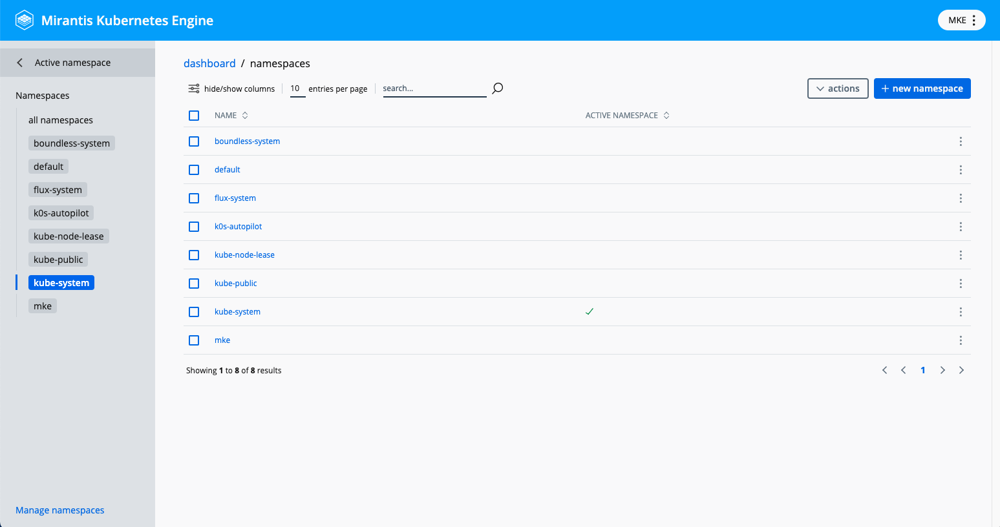
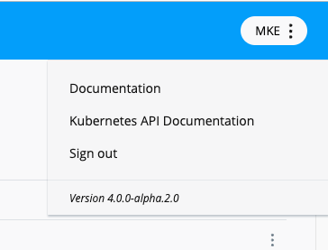

The table that follows details MKE 4 features and their current status. In
addition, where applicable, the table offers links to associated documentation.

| Feature                                                          | Pre-Release | Status   | 
|------------------------------------------------------------------|---------|----------|
| Authentication                                                   | alpha.1 | MVP      |  
| Authorization                                                    | alpha.1 | MVP      |   
| [Backup and restore](../../operations/backup-restore)            | alpha.1 | MVP      |
| CIS Benchmark                                                    |   |          |
| CLI                                                              |   |          |
| Cloud Providers                                                  |   |          |
| CoreDNS                                                          |   |          |
| cAdvisor                                                         |   |          |
| gMSA                                                             |   |          |
| GPU Feature Discovery                                            |   |          |
| [Ingress](../../operations/ingress)                              | alpha.1 | MVP      |  |
| [Kubernetes](../../concepts/architecture)                        | alpha.1 | MVP 1.29 |  |
| Life Cycle Management                                            |   |          |
| Licensing                                                        |   |          |
| Load Balancing                                                   |   |          |
| Logging, Monitoring and Alerting                                 | alpha.1 | MVP      |  
| [Networking (CNI)](../../concepts/architecture)                  | alpha.1 | MVP      |  
| Node Feature Discovery                                           |   |          |
| Offline Bundle                                                   |   |          |
| OpsCare                                                          |   |          |
| Policy Controller                                                |   |          |
| Storage (CSI)                                                    |   |          |
| Support Dump                                                     |   |          |
| Telemetry                                                        |   |          |
| TLS                                                              |   |          |
| 2FA                                                              |   |          |
| [Web UI](../../operations/install-dashboard)                      | alpha.2.0  |          |
| Windows                                                          |   |          |

## 4.0.0-alpha.2.0

### MKE Dashboard

- Metrics including node performance with usage statistics
- Basic Kubernetes management (View, Create, Update, and Delete):
  - Configurations: ConfigMaps
  - Controllers: ReplicaSets, ReplicationControllers, StatefulSets, Jobs, CronJobs, Daemonsets, and Deployments
  - Namespaces
  - Nodes
  - Pods
  - Services
  - ServiceAccounts
  - Storage: StorageClasses, PersistantVolumes + PersistantVolumeClaims
- View with Kubernetes resources by namespace or all namespaces at once

#### Namespace management

Namespaces can now be managed by clicking on the active namespace in the side menu.
This opens the namespace selector.

From there, if you want to manage your namespaces further (add, remove, etc), you
can click the Manage namespaces button at the bottom left to view the list of namespaces.

To return to the main menu, click the "Dashboard" icon in the breadcrumbs or
the back arrow next to the "active namespace" in the side navigation.

#### Sign out, MKE Version, and documentation links

The MKE version is now indicated in a new menu at the top right of the dashboard.
Here you will also find links to documentation and the "Sign out" option.

#### In development

- User management
- User settings
- Admin settings: authentication, ingress, backups, certificates, telemetry, and logging
- Support bundle access
- App notifications and alerts
- Improved detail view of individual Kubernetes resources
- Statuses for Kubernetes objects
- ... and more
